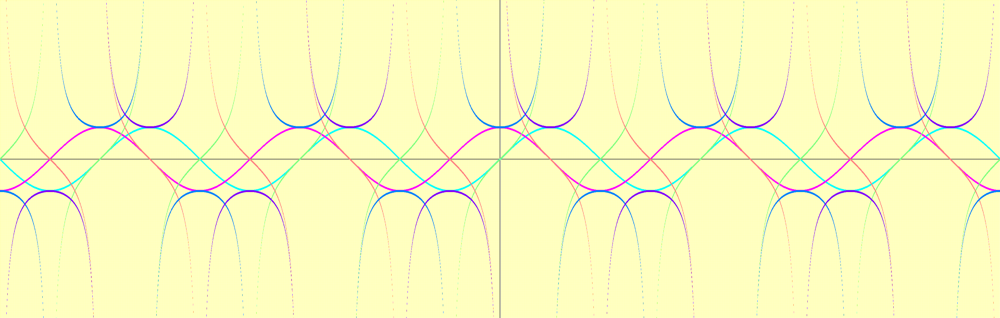
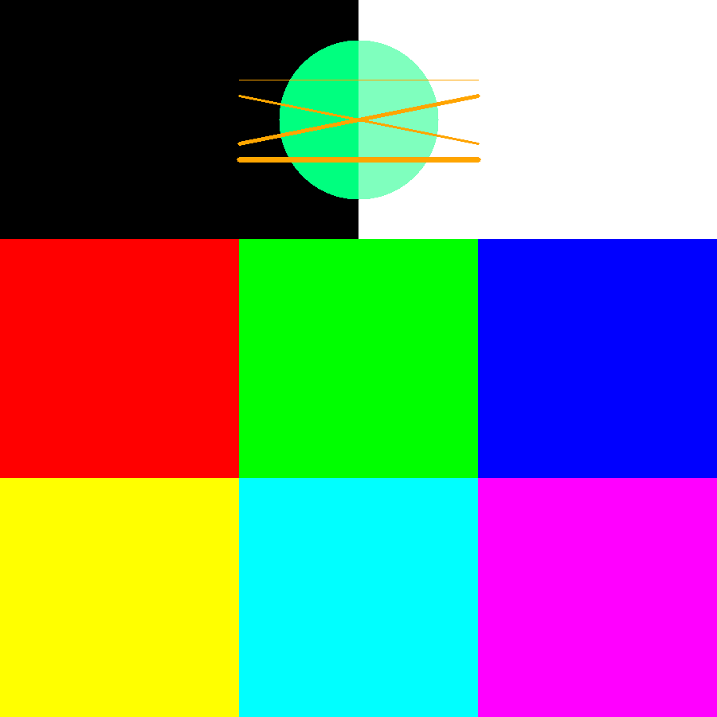
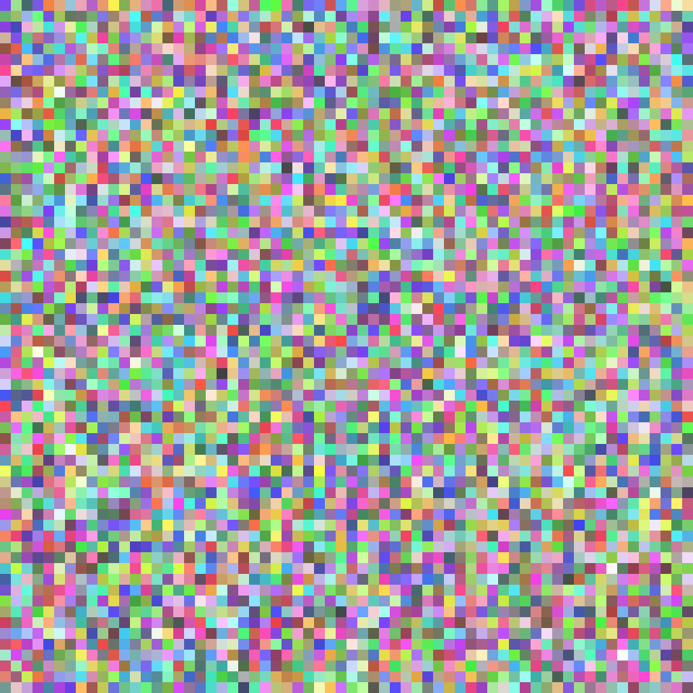
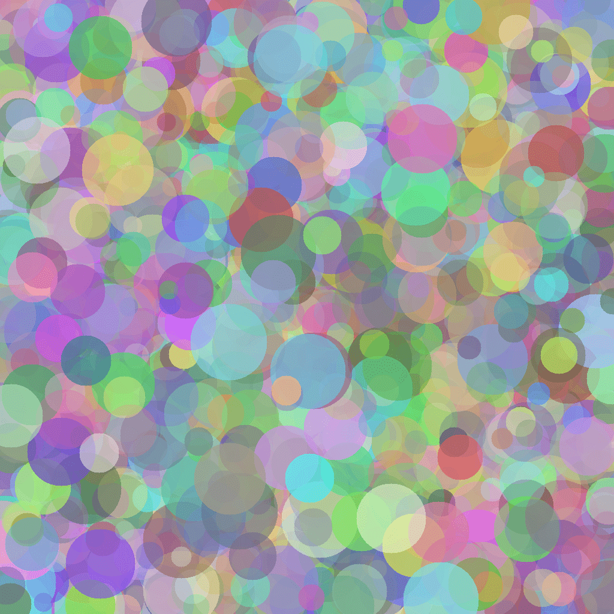

<div align="center">

# Cimple BMP



Simple BMP Library in C.

[Read / Write BMP](#read--write-bmp) ． [Create Empty BMP](#create-empty-bmp)

[Fill](#fill) ．
[Copy](#copy) ．
[Rect](#rect) ．
[Circle](#circle) ．
[Line](#line) ．
[Custom](#custom-drawing)

[Pixel Blend](#pixel)

</div>

## Features

### Read / Write BMP

```c
u8 read_bmp(string path, BMP* bmp);
```

This library should be able to read 16, 24, 32 bit BMP files.

```c
u8 write_bmp(BMP* bmp, string path, u8 red_bits, u8 green_bits, u8 blue_bits, u8 alpha_bits);
```

The following exporting formats are supported:

- 16 bit (RGB 555)
- 16 bit (RGB 565)
- 24 bit (RGB 888)
- 32 bit (RGBA 8888)

### Create Empty BMP

```c
BMP* create_bmp(u64 width, u64 height, Pixel pixel);
```

It will create a BMP with the specified width and height, and fill it with the specified pixel.

### Fill

```c
// as a method-like member of BMP
u64(*fill)(BMP* bmp, Pixel pixel);

// usage
BMP* bmp = create_bmp(100, 100, PIXEL_BLUE);
u64 count = bmp->fill(bmp, PIXEL_RED);
```

### Copy

```c
u64 bmp_copy(BMP* bmp, i64 from_x, i64 from_y, i64 width, i64 height, BMP* source, i64 source_x, i64 source_y);
```

This function will copy a rectangular area from the source BMP to the destination BMP.

### Rect

```c
// as a method-like member of BMP
u64(*rect)(BMP* bmp, i64 from_x, i64 from_y, i64 width, i64 height, Pixel pixel);

// usage
BMP* bmp = create_bmp(100, 100, PIXEL_BLUE);
u64 count = bmp->rect(bmp, 0, 0, 50, 100, PIXEL_RED);
```

This function will draw a rectangle on the BMP.

### Circle

```c
// as a method-like member of BMP
u64(*circle)(BMP* bmp, i64 center_x, i64 center_y, i64 radius, Pixel pixel);

// usage
BMP* bmp = create_bmp(100, 100, PIXEL_BLUE);
u64 count = bmp->circle(bmp, 50, 50, 30, PIXEL_RED);
```

This function will draw a filled circle on the BMP.

### Line

```c
// as a method-like member of BMP
u64(*line)(BMP* bmp, i64 from_x, i64 from_y, i64 to_x, i64 to_y, u64 width, Pixel pixel);

// usage
BMP* bmp = create_bmp(100, 100, PIXEL_BLUE);
u64 count = bmp->line(bmp, 20, 20, 80, 80, 5, PIXEL_RED);
```

### Custom Drawing

This library provides a simple but powerful way to draw custom shapes on the BMP.

```c
// as a method-like member of BMP
u64(*draw)(BMP* bmp, Pixel pixel, bool (*condition)(struct BMP*, i64 x, i64 y));

// usage
bool do_draw(struct BMP* bmp, i64 x, i64 y) {
    return x % 2 == 0 && y % 2 == 0;
}

BMP* bmp = create_bmp(100, 100, PIXEL_BLUE);
u64 count = bmp->draw(bmp, PIXEL_RED, &do_draw);
```

Passing a function pointer to the draw function will draw a pixel on the position if the condition is true.

### Pixel

Every BMP is composed of pixels.

```c
typedef struct Pixel {
    u8 red;
    u8 green;
    u8 blue;
    u8 alpha;
} Pixel;
```

There are some predefined pixel types:

```c
#define PIXEL_BLACK ((Pixel){ 0, 0, 0, 0xFF })
#define PIXEL_WHITE ((Pixel){ 0xFF, 0xFF, 0xFF, 0xFF })
#define PIXEL_RED ((Pixel){ 0xFF, 0, 0, 0xFF })
#define PIXEL_GREEN ((Pixel){ 0, 0xFF, 0, 0xFF })
#define PIXEL_BLUE ((Pixel){ 0, 0, 0xFF, 0xFF })
#define PIXEL_YELLOW ((Pixel){ 0xFF, 0xFF, 0, 0xFF })
#define PIXEL_CYAN ((Pixel){ 0, 0xFF, 0xFF, 0xFF })
#define PIXEL_MAGENTA ((Pixel){ 0xFF, 0, 0xFF, 0xFF })
#define PIXEL_BLACK_TRANSPARENT ((Pixel){ 0, 0, 0, 0 })
#define PIXEL_WHITE_TRANSPARENT ((Pixel){ 0xFF, 0xFF, 0xFF, 0 })
#define PIXEL_RED_TRANSPARENT ((Pixel){ 0xFF, 0, 0, 0 })
#define PIXEL_GREEN_TRANSPARENT ((Pixel){ 0, 0xFF, 0, 0 })
#define PIXEL_BLUE_TRANSPARENT ((Pixel){ 0, 0, 0xFF, 0 })
#define PIXEL_YELLOW_TRANSPARENT ((Pixel){ 0xFF, 0xFF, 0, 0 })
#define PIXEL_CYAN_TRANSPARENT ((Pixel){ 0, 0xFF, 0xFF, 0 })
#define PIXEL_MAGENTA_TRANSPARENT ((Pixel){ 0xFF, 0, 0xFF, 0 })
#define PIXEL_TRANSPARENT PIXEL_BLACK_TRANSPARENT
```



You can also use this to make your pixel:

```c
// Royal Blue, RGB: (0, 35, 102)
bmp->fill(bmp, (Pixel){ 0, 35, 102, 0 });
```

### Pixel Blend

```c
Pixel blend(Pixel a, Pixel b, f64 weight);

// usage
Pixel PIXEL_GRAY = blend(PIXEL_BLACK, PIXEL_WHITE, 0.5);
```

This function will blend the two source pixels and return the result.

### Pixel Over

```c
Pixel pixel_over(Pixel front, Pixel back);
```

The function will return the result of the pixel over operation (alpha blending).

### `RGB` & `RGBA`

```c
Pixel RGBA(u32 hex);
Pixel RGB(u32 hex);

// usage
Pixel PIXEL_RED = RGB(0xFF0000);
Pixel PIXEL_GREEN_TRANSPARENT = RGBA(0x00FF0080);
```

These two functions will convert the hexadecimal color value to a pixel.

## Images






> The images in this README are PNG files, which are converted from the BMP files.
